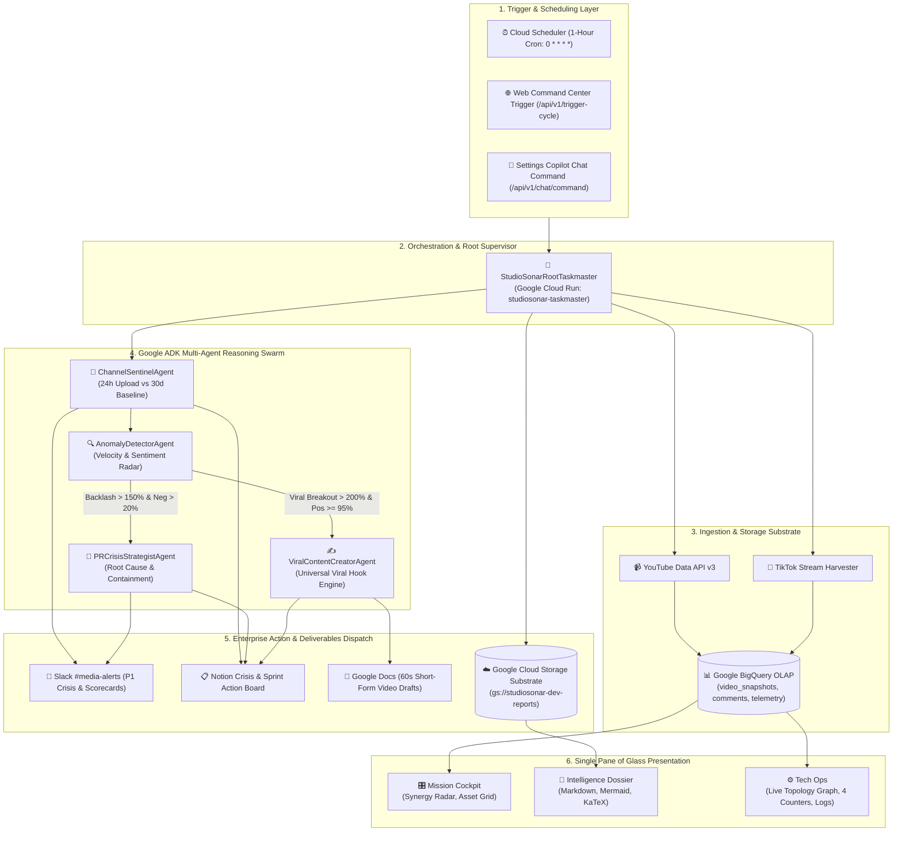
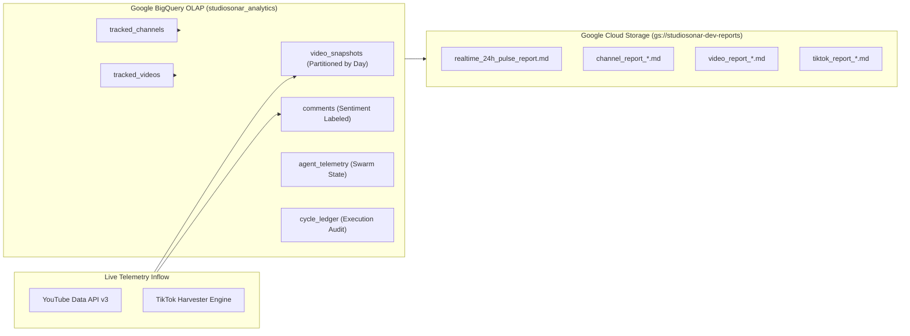

# 🏗️ StudioSonar Technical Architecture Blueprint

> **System:** StudioSonar Autonomous Media Intelligence & Brand Defense Swarm  
> **Engine:** Google Agent Development Kit (Google ADK v2.7.1) • **Model:** Gemini 3.7 Flash  
> **Cloud Substrate:** Google Cloud Run (5 Microservices Mesh) • BigQuery OLAP • Google Cloud Storage (GCS)  
> **Target Audience:** Solution Architects, AI Engineers, Enterprise DevOps & Technical Stakeholders

---

## 📑 Table of Contents
1. [Executive Summary & Core Philosophy](#1-executive-summary--core-philosophy)
2. [End-to-End Execution Flow](#2-end-to-end-execution-flow)
3. [System Architecture & Google ADK Multi-Agent Swarm](#3-system-architecture--google-adk-multi-agent-swarm)
4. [Mathematical Formulation: Velocity & Sentiment Detection](#4-mathematical-formulation-velocity--sentiment-detection)
5. [Storage & Data Substrate Architecture](#5-storage--data-substrate-architecture)
6. [Scheduled Jobs, Background Tasks & Execution Modes](#6-scheduled-jobs-background-tasks--execution-modes)
7. [Enterprise Deployment Guide (Step-by-Step)](#7-enterprise-deployment-guide-step-by-step)
8. [Live Production Infrastructure & Endpoints](#8-live-production-infrastructure--endpoints)

---

## 1. Executive Summary & Core Philosophy

StudioSonar is an **autonomous, zero-prompt multi-agent swarm** that operates continuously in the background to monitor, analyze, and defend media assets and brand reputation across YouTube and TikTok. 

Unlike traditional passive AI chatbots that wait for human prompts (*"How can I help you?"*), StudioSonar:
1. **Self-Initiates:** Wakes autonomously via **Google Cloud Scheduler** (`0 * * * *`).
2. **Ingests & Stores:** Fetches live social telemetry into **Google BigQuery OLAP** partitions.
3. **Applies Mathematical Velocity & Sentiment Models:** Detects early algorithm surges and viral friction before humans notice.
4. **Coordinates Multi-Agent Mesh:** Conducts **Agent-to-Agent (A2A)** handoffs using **Google ADK**.
5. **Executes Enterprise Actions:** Dispatches **Slack P1 Red Alerts**, updates **Notion Crisis Action Boards**, drafts 60s viral scripts in **Google Docs**, and publishes live intelligence dossiers directly to **Google Cloud Storage (GCS)**.

---

## 2. End-to-End Execution Flow

### 2.1 Complete Flowchart Architecture



---

### 2.2 Sequence Diagram of an Autonomous Swarm Cycle

```mermaid
sequenceDiagram
    autonumber
    actor Scheduler as ⏰ Cloud Scheduler (0 * * * *)
    participant Taskmaster as 👑 Root Taskmaster
    participant Sentinel as 📡 Channel Sentinel
    participant Anomaly as 🔍 Anomaly Detector
    participant PRCrisis as 🚨 PR Crisis Strategist
    participant ContentCreator as ✍️ Viral Creator
    participant BigQuery as 📊 BigQuery OLAP
    participant GCS as ☁️ GCS Bucket
    participant External as 📢 Slack / Notion / GDocs

    Scheduler->>Taskmaster: POST /api/v1/trigger-cycle (cycle_type: "ALL")
    
    rect rgb(20, 30, 50)
        Note over Taskmaster,BigQuery: Step 0: Ingestion
        Taskmaster->>BigQuery: Ingest raw snapshots from YouTube API v3 & TikTok
    end

    rect rgb(25, 45, 60)
        Note over Taskmaster,Sentinel: Step 1: Channel Surveillance
        Taskmaster->>Sentinel: A2A Handoff (Check 24h uploads vs 30d baseline)
        Sentinel->>Sentinel: Calculate V_ratio & CVR Scorecard
        Sentinel->>External: Dispatch Slack Scorecard & Notion Action Board
    end

    rect rgb(45, 30, 60)
        Note over Sentinel,Anomaly: Step 2: Anomaly Detection
        Taskmaster->>Anomaly: A2A Handoff (Query sentiment & velocity spikes)
        Anomaly->>BigQuery: Query rolling 6h velocity anomalies
    end

    alt Negative Backlash Spike (> 150% Velocity & > 20% Negative Sentiment)
        Anomaly->>PRCrisis: A2A Handoff (Anomaly metadata & quotes)
        PRCrisis->>PRCrisis: Synthesize Root Cause with Gemini 3.7 Flash
        PRCrisis->>External: Dispatch Slack P1 Red Alert & Notion Emergency Board
    else Positive Viral Breakout (> 200% Velocity & >= 95% Positive Sentiment)
        Anomaly->>ContentCreator: A2A Handoff (Breakout trend & momentum context)
        ContentCreator->>ContentCreator: Apply Universal Viral Hook Playbook (3s Hook)
        ContentCreator->>External: Create Google Doc Script & Notion Sprint Card
    end

    rect rgb(20, 45, 35)
        Note over Taskmaster,GCS: Step 3: Centralized Dossier Publishing
        Taskmaster->>Taskmaster: Parallel LLM Report Authoring Engine (12 Dossiers)
        Taskmaster->>GCS: Save realtime_24h_pulse_report.md & channel dossiers
        Taskmaster->>BigQuery: Synchronize Agent Telemetry & Reasoning Traces
    end
```



---

## 3. System Architecture & Google ADK Multi-Agent Swarm

### 3.1 Google ADK Architecture (Pure ADK vs. Monolith Scripts)

StudioSonar uses **Google ADK (v2.7.1)** as its central multi-agent framework:

```
┌─────────────────────────────────────────────────────────────────────────────┐
│ 👑 ROOT TASKMASTER SUPERVISOR (google.adk.Agent)                           │
│ • Instruction: Central Orchestrator, Cross-Platform Governance, Dossiers    │
│ • Sub-Agents: [ChannelSentinel, AnomalyDetector, PRCrisis, ViralContent]    │
└─────────────────────────────────────────────────────────────────────────────┘
                                       │
                         google.adk.Workflow Graph
                                       ▼
┌──────────────────┐     ┌──────────────────┐     ┌───────────────────────────┐
│ 📡 CHANNEL       │ ──► │ 🔍 ANOMALY       │ ─┬─► │ 🚨 PR CRISIS STRATEGIST   │
│    SENTINEL      │     │    DETECTOR      │  │   └───────────────────────────┘
└──────────────────┘     └──────────────────┘  │   ┌───────────────────────────┐
                                               └─► │ ✍️ VIRAL CONTENT CREATOR  │
                                                   └───────────────────────────┘
```

#### Code Implementation in `src/agents/orchestrator.py`:
```python
from google.adk import Agent, Workflow
from src.agents.base_agent import create_pure_adk_agent
from src.agents.channel_monitor_agent import channel_monitor_agent
from src.agents.anomaly_detector_agent import anomaly_detector_agent
from src.agents.pr_crisis_agent import pr_crisis_agent
from src.agents.viral_content_agent import viral_content_agent

# 1. Native Hierarchical Supervisor
taskmaster_agent: Agent = create_pure_adk_agent(
    name="StudioSonarRootTaskmaster",
    instruction="Central supervisor of autonomous media intelligence swarm...",
    sub_agents=[
        channel_monitor_agent,
        anomaly_detector_agent,
        pr_crisis_agent,
        viral_content_agent
    ]
)

# 2. Native Topological Workflow Graph
taskmaster_workflow: Workflow = Workflow(
    name="StudioSonarAutonomousWorkflow",
    edges=[
        ("START", channel_monitor_agent),
        (channel_monitor_agent, anomaly_detector_agent),
        (anomaly_detector_agent, pr_crisis_agent),
        (anomaly_detector_agent, viral_content_agent)
    ]
)
```

---

### 3.2 The 5 Microservices Mesh Architecture

StudioSonar is split across **5 independent Google Cloud Run services**:

| Microservice | Role & Responsibility | Scaling Policy | Tools & MCP Bindings |
| :--- | :--- | :---: | :--- |
| **`studiosonar-taskmaster`** | Central commander, Web Dashboard UI, GCS publisher, and scheduler target. | Min: 0 • Max: 3 | BigQuery Client, GCS Manager, YouTube Client |
| **`studiosonar-channel-monitor`** | Channel surveillance, 24h upload monitoring, 30d baseline comparison. | Scale-to-Zero | Channel Tools, Slack Scorecard, Notion Board |
| **`studiosonar-anomaly-detector`** | BigQuery OLAP sentiment & comment velocity math radar. | Scale-to-Zero | BigQuery Spike Query, Trend Scanner |
| **`studiosonar-pr-strategist`** | Cognitive root-cause synthesis for brand defense and crisis containment. | Scale-to-Zero | Slack Crisis Alert, Notion Triage Board |
| **`studiosonar-content-creator`** | Universal Viral Hook generation, 60s short-form script writing. | Scale-to-Zero | GDocs Video Script, Notion Sprint Board |

#### Dual-Tier Fault Tolerance:
1. **Tier 1 (HTTP A2A Mesh):** The Taskmaster dispatches HTTP requests to the dedicated Cloud Run microservice endpoint (`CHANNEL_MONITOR_URL`, `ANOMALY_DETECTOR_URL`, etc.).
2. **Tier 2 (In-Process Fallback):** If a network timeout or partition occurs, the Taskmaster automatically falls back to invoking the agent class in-process, guaranteeing the hourly cycle never crashes.

---

## 4. Mathematical Formulation: Velocity & Sentiment Detection

StudioSonar replaces manual monitoring with deterministic formulas computed over BigQuery time-series snapshots.

### 4.1 Current Hourly Velocity ($V_{\text{current}}$)
Measures the hourly velocity of views or comments since upload:

$$V_{\text{current}} = \frac{\text{Total Views (or Comments)}}{\text{Hours Elapsed Since Publication}}$$

---

### 4.2 Channel Historical Baseline ($V_{\text{baseline}}$)
Normal expected hourly performance derived from 30-day BigQuery historical benchmarks:

$$V_{\text{baseline}} = \frac{\text{30-Day Average Views Per Video}}{30 \text{ days} \times 24 \text{ hours}}$$

---

### 4.3 Velocity Acceleration Surge ($\Delta \text{Velocity} \%$)
The relative percentage deviation between current asset velocity and channel historical baseline:

$$\Delta \text{Velocity} \% = \left( \frac{V_{\text{current}} - V_{\text{baseline}}}{V_{\text{baseline}}} \right) \times 100\%$$

---

### 4.4 Early Upload Heat Ratio ($V_{\text{ratio}}$)
Compares initial 24h upload traction to standard channel performance:

$$V_{\text{ratio}} = \frac{V_{\text{new, 24h}}}{V_{\text{baseline}}}$$

* **🔥 Hot Viral Breakout ($V_{\text{ratio}} \ge 2.0x$):** New video velocity is $2\times$ faster than standard channel uploads.
* **⚡ Steady Momentum ($1.0x \le V_{\text{ratio}} < 2.0x$):** Healthy performance meeting channel expectations.
* **⚠️ Underperforming ($V_{\text{ratio}} < 0.5x$):** Traction is weak; prompts thumbnail & title optimization.

---

### 4.5 Comment Conversion Density ($\text{CVR}$) & Hourly Inflow ($V_{\text{comment}}$)
Measures active engagement and audience discourse density:

$$\text{CVR} = \left( \frac{\text{Total Comments}}{\text{Total Views}} \right) \times 100\% \qquad\qquad V_{\text{comment}} = \frac{\Delta \text{Comments}}{\Delta t \text{ (hours)}}$$

---

### 4.6 Routing Decision Matrix

| Mathematical Condition | Qualitative Tag | Swarm Action & Handoff |
| :--- | :--- | :--- |
| $\Delta \text{Velocity} \% > +200\%$ AND Positive Sentiment $\ge 95\%$ | 🚀 **Viral Retention Surge** | Handoff to `ViralContentCreatorAgent` $\to$ Draft 60s Script in Google Docs. |
| $\Delta \text{Velocity} \% > +150\%$ AND Negative Sentiment $\ge 20\%$ | 🚨 **PR Backlash Surge** | Handoff to `PRCrisisStrategistAgent` $\to$ Dispatch Slack Alert P1 & Notion Triage. |
| $-20\% \le \Delta \text{Velocity} \% \le +50\%$ | 🟢 **Steady Engagement** | Update real-time GCS Dossier; continue regular 1h surveillance. |

---

## 5. Storage & Data Substrate Architecture



### 5.1 Google BigQuery OLAP Database
* **Dataset:** `studiosonar-dev.studiosonar_analytics`
* **Partitioning & Clustering:** `video_snapshots` partitioned by `DATE(snapshot_timestamp)` and clustered by `video_id`.
* **Zero-Hardcoding Dynamic Registry:** Monitored channels and videos are queried live from `tracked_channels` and `tracked_videos`. Adding or removing an asset in BigQuery updates the system immediately without code changes or redeployments.

### 5.2 Google Cloud Storage (GCS) Report Substrate
* **Bucket:** `gs://studiosonar-dev-reports` (Region: `us-central1`)
* **Stateless Microservices:** Containers do not store state locally. All reports are written to and read from GCS with zero-cache headers (`Cache-Control: no-cache, no-store`).

---

## 6. Scheduled Jobs, Background Tasks & Execution Modes

StudioSonar runs **5 distinct background jobs & execution engines**:

### ⏱️ Job 1: Cloud Scheduler Autonomous Heartbeat (`studiosonar-taskmaster-heartbeat`)
* **Trigger:** Google Cloud Scheduler
* **Schedule:** `0 * * * *` (Every 1 hour, 24/7)
* **Target:** `POST https://studiosonar-taskmaster-i7mjye6viq-uc.a.run.app/api/v1/trigger-cycle`
* **Function:** Triggers the end-to-end multi-agent cycle: BigQuery snapshot ingestion $\to$ Channel Sentinel benchmark $\to$ Anomaly detection $\to$ PR/Viral handoffs $\to$ Parallel GCS report authoring.

### 🤖 Job 2: Cloud Run Job (`studiosonar-taskmaster-job`)
* **Type:** Google Cloud Run Job (Batch Runner)
* **Command:** `python3 -m src.demo.run_taskmaster_demo`
* **Function:** Independent batch execution container for on-demand evaluation, benchmark replay, and demonstration without running the web server.

### 🔄 Job 3: BigQuery Telemetry Synchronization Job (`telemetry_sync`)
* **Trigger:** Executed at the end of every swarm cycle.
* **Function:** Records CPU/RAM container resources (`resource.getrusage`), active agent states, tool execution durations, and Gemini cognitive reasoning logs into `agent_telemetry`.

### ⚡ Job 4: Parallel LLM Report Authoring Engine (`llm_report_author`)
* **Concurrency:** Multi-threaded `ThreadPoolExecutor` (Worker threads: 6).
* **Function:** Generates 12 detailed intelligence dossiers concurrently via Vertex AI Gemini Flash and streams them directly into GCS.

### 🌱 Job 5: Registry Auto-Seeder & Self-Healer (`registry_seeder`)
* **Trigger:** FastAPI startup event (`_seed_registry_on_startup`).
* **Function:** Idempotently checks BigQuery tables; if empty, automatically seeds canonical enterprise sample assets (Phương Mỹ Chi, Thùy Chi, Ferrero Nutella, Bloomberg Originals, Kiểm Định Phim).

---

## 7. Enterprise Deployment Guide (Step-by-Step)

### 7.1 Prerequisites
* Google Cloud SDK (`gcloud` CLI installed and authenticated)
* Google BigQuery CLI (`bq`)
* GCP Project with billing enabled (e.g. `studiosonar-dev`)
* Service Account permissions:
  * `roles/run.admin` (Cloud Run deployment)
  * `roles/bigquery.admin` (BigQuery dataset and table management)
  * `roles/storage.objectAdmin` (GCS report bucket read/write)
  * `roles/aiplatform.user` (Vertex AI Gemini Flash inference)
  * `roles/cloudscheduler.admin` (Cloud Scheduler job creation)

---

### 7.2 Step 1: Enable Google Cloud APIs
```bash
export GCP_PROJECT_ID="studiosonar-dev"
export GCP_LOCATION="us-central1"

gcloud services enable \
  run.googleapis.com \
  bigquery.googleapis.com \
  cloudscheduler.googleapis.com \
  cloudbuild.googleapis.com \
  storage.googleapis.com \
  aiplatform.googleapis.com \
  youtube.googleapis.com \
  --project="${GCP_PROJECT_ID}"
```

---

### 7.3 Step 2: Initialize BigQuery Dataset & Tables
```bash
# Create dataset if not exists
bq show --project_id="${GCP_PROJECT_ID}" studiosonar_analytics >/dev/null 2>&1 || \
  bq mk --project_id="${GCP_PROJECT_ID}" --location="${GCP_LOCATION}" --dataset studiosonar_analytics

# Execute SQL DDL schema
bq query --use_legacy_sql=false --project_id="${GCP_PROJECT_ID}" < infra/bq_schema.sql
```

---

### 7.4 Step 3: Create GCS Intelligence Reports Bucket
```bash
gcloud storage buckets create gs://studiosonar-dev-reports \
  --project="${GCP_PROJECT_ID}" \
  --location="${GCP_LOCATION}" \
  --uniform-bucket-level-access || true
```

---

### 7.5 Step 4: Build Container Image via Cloud Build
```bash
gcloud builds submit \
  --tag "gcr.io/${GCP_PROJECT_ID}/studiosonar-taskmaster:latest" \
  --project="${GCP_PROJECT_ID}" .
```

---

### 7.6 Step 5: Deploy the 4 Specialized Agent Microservices
```bash
IMAGE_NAME="gcr.io/${GCP_PROJECT_ID}/studiosonar-taskmaster:latest"
COMMON_FLAGS="--image=${IMAGE_NAME} --platform=managed --region=${GCP_LOCATION} --project=${GCP_PROJECT_ID} --allow-unauthenticated --min-instances=0 --max-instances=2 --memory=512Mi --cpu=1 --concurrency=80 --cpu-throttling --timeout=60s"

# 1. Channel Sentinel Agent
gcloud run deploy studiosonar-channel-monitor ${COMMON_FLAGS} \
  --set-env-vars="GCP_PROJECT_ID=${GCP_PROJECT_ID},GCP_LOCATION=${GCP_LOCATION},BIGQUERY_DATASET=studiosonar_analytics,EXECUTION_MODE=live,GEMINI_MODEL=gemini-3.7-flash"

CHANNEL_MONITOR_URL=$(gcloud run services describe studiosonar-channel-monitor --region="${GCP_LOCATION}" --project="${GCP_PROJECT_ID}" --format='value(status.url)')

# 2. Anomaly Detector Agent
gcloud run deploy studiosonar-anomaly-detector ${COMMON_FLAGS} \
  --set-env-vars="GCP_PROJECT_ID=${GCP_PROJECT_ID},GCP_LOCATION=${GCP_LOCATION},BIGQUERY_DATASET=studiosonar_analytics,EXECUTION_MODE=live,GEMINI_MODEL=gemini-3.7-flash"

ANOMALY_DETECTOR_URL=$(gcloud run services describe studiosonar-anomaly-detector --region="${GCP_LOCATION}" --project="${GCP_PROJECT_ID}" --format='value(status.url)')

# 3. PR Crisis Strategist Agent
gcloud run deploy studiosonar-pr-strategist ${COMMON_FLAGS} \
  --set-env-vars="GCP_PROJECT_ID=${GCP_PROJECT_ID},GCP_LOCATION=${GCP_LOCATION},BIGQUERY_DATASET=studiosonar_analytics,EXECUTION_MODE=live,GEMINI_MODEL=gemini-3.7-flash"

PR_STRATEGIST_URL=$(gcloud run services describe studiosonar-pr-strategist --region="${GCP_LOCATION}" --project="${GCP_PROJECT_ID}" --format='value(status.url)')

# 4. Viral Content Creator Agent
gcloud run deploy studiosonar-content-creator ${COMMON_FLAGS} \
  --set-env-vars="GCP_PROJECT_ID=${GCP_PROJECT_ID},GCP_LOCATION=${GCP_LOCATION},BIGQUERY_DATASET=studiosonar_analytics,EXECUTION_MODE=live,GEMINI_MODEL=gemini-3.7-flash"

CONTENT_CREATOR_URL=$(gcloud run services describe studiosonar-content-creator --region="${GCP_LOCATION}" --project="${GCP_PROJECT_ID}" --format='value(status.url)')
```

---

### 7.7 Step 6: Deploy Root Taskmaster Orchestrator (Connected to A2A Mesh)
```bash
gcloud run deploy studiosonar-taskmaster \
  --image="${IMAGE_NAME}" \
  --platform=managed \
  --region="${GCP_LOCATION}" \
  --project="${GCP_PROJECT_ID}" \
  --allow-unauthenticated \
  --min-instances=0 \
  --max-instances=3 \
  --memory=512Mi \
  --cpu=1 \
  --concurrency=80 \
  --cpu-throttling \
  --timeout=60s \
  --set-env-vars="GCP_PROJECT_ID=${GCP_PROJECT_ID},GCP_LOCATION=${GCP_LOCATION},BIGQUERY_DATASET=studiosonar_analytics,EXECUTION_MODE=live,GEMINI_MODEL=gemini-3.7-flash,CHANNEL_MONITOR_URL=${CHANNEL_MONITOR_URL},ANOMALY_DETECTOR_URL=${ANOMALY_DETECTOR_URL},PR_STRATEGIST_URL=${PR_STRATEGIST_URL},CONTENT_CREATOR_URL=${CONTENT_CREATOR_URL}"

TASKMASTER_URL=$(gcloud run services describe studiosonar-taskmaster --region="${GCP_LOCATION}" --project="${GCP_PROJECT_ID}" --format='value(status.url)')
```

---

### 7.8 Step 7: Configure Cloud Scheduler Heartbeat (1-Hour Interval)
```bash
gcloud scheduler jobs create http studiosonar-taskmaster-heartbeat \
  --location="${GCP_LOCATION}" \
  --project="${GCP_PROJECT_ID}" \
  --schedule="0 * * * *" \
  --uri="${TASKMASTER_URL}/api/v1/trigger-cycle" \
  --http-method=POST \
  --attempt-deadline=180s \
  --description="Autonomous 1-hour heartbeat triggering Google ADK Multi-Agent Taskmaster cycle" || \
gcloud scheduler jobs update http studiosonar-taskmaster-heartbeat \
  --location="${GCP_LOCATION}" \
  --project="${GCP_PROJECT_ID}" \
  --schedule="0 * * * *" \
  --uri="${TASKMASTER_URL}/api/v1/trigger-cycle" \
  --http-method=POST \
  --attempt-deadline=180s
```

---

## 8. Live Production Infrastructure & Endpoints

| Microservice / Component | Live URL / Resource Path | Role |
| :--- | :--- | :--- |
| 👑 **Root Taskmaster & Dashboard** | `https://studiosonar-taskmaster-i7mjye6viq-uc.a.run.app` | Central Commander & UI |
| 📡 **Channel Sentinel Agent** | `https://studiosonar-channel-monitor-598161588592.us-central1.run.app` | Watchdog & Benchmarks |
| 🔍 **Anomaly Detector Agent** | `https://studiosonar-anomaly-detector-598161588592.us-central1.run.app` | BigQuery Math Radar |
| 🚨 **PR Crisis Strategist Agent** | `https://studiosonar-pr-strategist-598161588592.us-central1.run.app` | Brand Defense & Slack Alerts |
| ✍️ **Viral Content Creator Agent** | `https://studiosonar-content-creator-598161588592.us-central1.run.app` | 60s Video Scripts & GDocs |
| ⏱️ **Cloud Scheduler Heartbeat** | `projects/studiosonar-dev/locations/us-central1/jobs/studiosonar-taskmaster-heartbeat` | 1-Hour Cron (`0 * * * *`) |
| ☁️ **GCS Reports Storage** | `gs://studiosonar-dev-reports` | Markdown Dossier Substrate |
| 📊 **BigQuery OLAP Dataset** | `studiosonar-dev.studiosonar_analytics` | Historical Telemetry Ledger |
