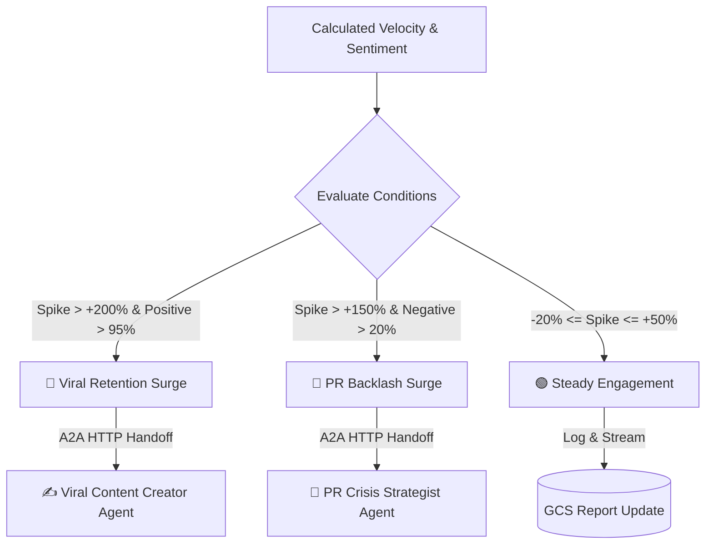
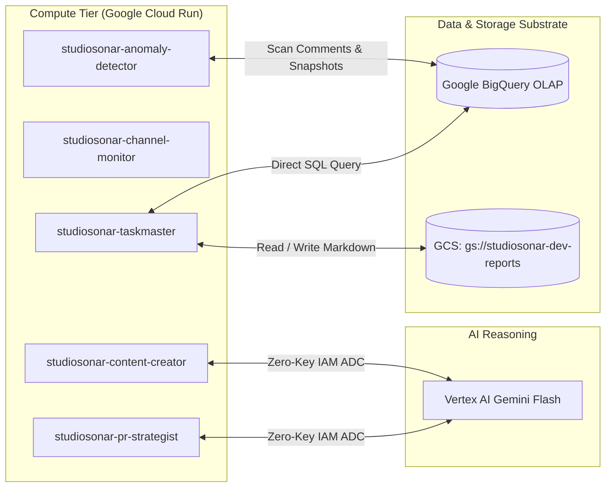
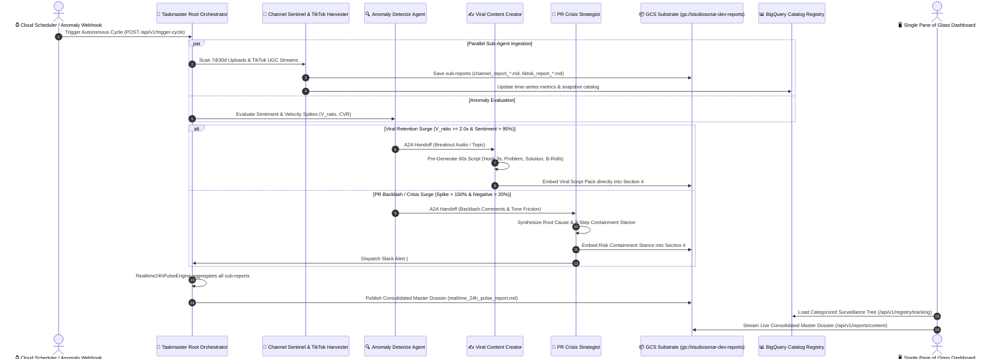

# 🏗️ StudioSonar Technical Architecture: How We Solve Autonomous Media Intelligence

This document outlines the **deep engineering architecture, mathematical formulas, and Google Cloud infrastructure** that power StudioSonar.

---

## 🏛️ System Architecture Topology

StudioSonar is architected as a **distributed microservice mesh** of 5 specialized Google Agent Development Kit (ADK) agents deployed on **Google Cloud Run**, backed by **Google BigQuery** and **Google Cloud Storage (GCS)**.

```
                           ┌────────────────────────────────────────┐
                           │      Cloud Scheduler (1h Cron)         │
                           └──────────────────┬─────────────────────┘
                                              │ POST /api/v1/trigger-cycle
                                              ▼
                    ┌──────────────────────────────────────────────────┐
                    │      👑 Taskmaster Root Orchestrator             │
                    │      (Cloud Run: studiosonar-taskmaster)         │
                    └───────┬──────────────────────────┬───────────────┘
                            │                          │
           A2A HTTP Handoff │         A2A HTTP Handoff │
                            ▼                          ▼
   ┌───────────────────────────────────┐    ┌───────────────────────────────────┐
   │    📡 Channel Sentinel Agent      │    │    🔍 Anomaly Detector Agent      │
   │ (studiosonar-channel-monitor)     │    │ (studiosonar-anomaly-detector)    │
   └───────────────────────────────────┘    └───────┬───────────────────┬───────┘
                                                    │                   │
                                   Velocity > 150%  │                   │ Velocity > 200%
                                   Negative Surge   │                   │ Positive Surge
                                                    ▼                   ▼
                                 ┌──────────────────────┐   ┌──────────────────────┐
                                 │ 🚨 PR Crisis Agent   │   │ ✍️ Content Creator    │
                                 │ (studiosonar-pr)     │   │ (studiosonar-content)│
                                 └──────────┬───────────┘   └──────────┬───────────┘
                                            │                          │
                                            ▼                          ▼
                                 [Slack Alert + Notion]        [Google Docs Script]
```

---

## 🧠 Deep Engineering Rationale: Why Google ADK & Why Microservices Mesh?

### 1. The Architectural Anti-Pattern: "Tool-as-Agent" vs. "Agent-as-Strategist"
A common mistake in AI engineering is creating individual "agents" for trivial I/O tasks (e.g., an agent to fetch comments, an agent to query BigQuery). This introduces massive LLM token overhead, network latency, and indeterminism.
* **StudioSonar's Clean Separation:**
  * **I/O & Data Muscle (Tools Layer):** Deterministic Python connectors (`YouTubeLiveClient`, `TikTokStreamHarvester`, `BigQueryOLAP`, `GCSReportManager`) execute fast, reliable data operations without LLM overhead.
  * **Cognitive Swarm (Google ADK Agents Layer):** Agents focus strictly on **higher-order reasoning, risk evaluation, A2A handoffs, and strategic synthesis**.

### 2. Why Google ADK (v2.7.1) Over Traditional Python Scripts or LangChain?
* **100% Native Google ADK Architecture:** Every agent is directly instantiated via `google.adk.Agent` and coordinated through `google.adk.Workflow` graph-based edges:
  ```python
  from google.adk import Agent, Workflow

  native_taskmaster_workflow = Workflow(
      name="StudioSonarAutonomousWorkflow",
      edges=[
          ("START", native_channel_monitor_agent),
          (native_channel_monitor_agent, native_anomaly_detector),
          (native_anomaly_detector, native_pr_crisis_agent),
          (native_anomaly_detector, native_viral_content_agent)
      ]
  )
  ```
* **Declarative Function Tools:** All MCP tools in `src/mcp/` follow strict Google-Style docstrings and type annotations, allowing Gemini Flash to auto-extract function schemas seamlessly.
* **Native Agent-to-Agent (A2A) Handoffs:** Standardizes context transfer across decentralized microservices, eliminating fragile API glue.
* **Role-Based Least-Privilege Tool Binding:** Each agent is scoped strictly to its operational domain (e.g., `PRCrisisStrategistAgent` only has access to Slack/Notion dispatchers, preventing accidental script publishing).
* **Dual-Tier Fault Tolerance:** Built-in in-process fallback ensures that temporary network partitions between Cloud Run services never crash the hourly Taskmaster cycle.
* **Auditability & Observability:** Every reasoning step, tool call, and handoff payload is recorded in structured telemetry for enterprise compliance.

### 3. Why a Distributed Cloud Run Mesh Over a Monolith?
* **Asymmetric Compute Scaling:** The Taskmaster runs on a 1-hour cron; Anomaly Detector runs heavy BigQuery batch scans; PR Crisis and Viral Creator scale to **zero instances** during calm periods, reducing idle infrastructure costs by **>90%**.
* **Zero-Downtime Hot Upgrades:** New agent versions or viral playbooks can be deployed independently without restarting the central telemetry orchestrator.

---

## 📐 Mathematical Formulation of Velocity & Sentiment Spikes


StudioSonar replaces qualitative guesswork with deterministic mathematical modeling calculated over BigQuery time-series snapshots.

### 1. Current Video Velocity ($V_{\text{current}}$)
Measures the real-time inflow rate of views or comments per hour elapsed since publication:

$$V_{\text{current}} = \frac{\Delta \text{Metric}}{\Delta t_{\text{hours}}} = \frac{\text{Total Views (or Comments)}}{\text{Hours Elapsed Since Published}}$$

*Example:* For Phương Mỹ Chi's *'Thiên Đường Với Người Thương'* (14,089,095 views over 120 hours):
$$V_{\text{current}} = \frac{14,089,095}{120} = \mathbf{117,409.1 \text{ views/hour}}$$

---

### 2. Channel Historical Baseline Velocity ($V_{\text{baseline}}$)
Represents the normal hourly performance expected for a standard upload on that channel, derived from 30-day BigQuery historical benchmarks:

$$V_{\text{baseline}} = \frac{\text{30-Day Average Views Per Video}}{30 \text{ days} \times 24 \text{ hours}}$$

*Example:* With a channel baseline of ~20,613,600 views/month per video:
$$V_{\text{baseline}} = \frac{20,613,600}{720} \approx \mathbf{28,630.0 \text{ views/hour}}$$

---

### 3. Velocity Spike & Acceleration Metric ($\Delta \text{Velocity} \%$)
The relative percentage deviation between current asset performance and historical baseline:

$$\text{Velocity Spike \%} = \left( \frac{V_{\text{current}} - V_{\text{baseline}}}{V_{\text{baseline}}} \right) \times 100\%$$

$$\text{Velocity Spike \%} = \left( \frac{117,409.1 - 28,630.0}{28,630.0} \right) \times 100\% = \mathbf{+310.0\%}$$

---

### 4. Channel Sentinel Early Upload Heat Ratio ($V_{\text{ratio}}$)
When a monitored channel publishes a new video, the `ChannelSentinelAgent` measures the initial 24h performance against the channel's 30-day baseline to detect early algorithmic breakouts:

$$V_{\text{ratio}} = \frac{V_{\text{new, 24h}}}{V_{\text{baseline}}}$$

* **🔥 Hot Viral Breakout ($V_{\text{ratio}} \ge 2.0x$):** New video velocity is $2\times$ faster than the channel's standard upload.
* **⚡ Steady Momentum ($1.0x \le V_{\text{ratio}} < 2.0x$):** Healthy performance meeting channel benchmark.
* **⚠️ Underperforming ($V_{\text{ratio}} < 0.5x$):** Sub-par traction, triggering recommendations for thumbnail and title optimization.

---

### 5. Hot Interactive Comment Density ($\text{CVR}$) & Discussion Inflow ($V_{\text{comment}}$)
Views measure passive impressions, whereas **Comments represent active cognitive engagement, commercial intent, and organic virality**. The `ChannelSentinelAgent` continuously evaluates:

$$\text{CVR} = \left( \frac{\text{Total Comments}}{\text{Total Views}} \right) \times 100\%$$

$$V_{\text{comment}} = \frac{\Delta \text{Comments}}{\Delta t \text{ (hours)}}$$


* **🔥 Hyper-Interactive ($\text{CVR} \ge 0.8\%$ or $V_{\text{comment}} \ge 20 \text{ comments/h}$):** High organic debate, commercial inquiries, or cultural controversy.
* **⚡ Healthy Engagement ($0.3\% \le \text{CVR} < 0.8\%$):** Standard interactive community retention.
* **⚪ Passive Consumption ($\text{CVR} < 0.2\%$):** Clickbait/low-retention watching without community stickiness.

---

### 6. Deterministic Classification & Multi-Agent Routing Matrix


The `AnomalyDetectorAgent` evaluates the calculated $\Delta \text{Velocity} \%$ and sentiment ratio against deterministic decision boundaries:



| Decision Threshold | Qualitative Tag | Swarm Remediation Action |
| :--- | :--- | :--- |
| **Spike $> +200\%$** AND **Positive $\ge 95\%$** | 🚀 **Viral Retention Surge** | Triggers `ViralContentCreatorAgent` to draft a 60s short-form script in Google Docs. |
| **Spike $> +150\%$** AND **Negative $\ge 20\%$** | 🚨 **PR Backlash Surge** | Triggers `PRCrisisStrategistAgent` to dispatch Slack alert and Notion triage board. |
| **$-20\% \le \text{Spike} \le +50\%$** | 🟢 **Steady Engagement** | Updates real-time GCS intelligence report; continues normal hourly polling. |

---

## 🗄️ Storage & Infrastructure Architecture




### 1. Google BigQuery OLAP Storage
* **Dataset:** `studiosonar-dev.studiosonar_analytics`
* **Tables:**
  - `videos`: Master video tracking registry, metadata, and dynamic status.
  - `video_snapshots`: Time-series hourly telemetry snapshots (views, likes, comments, velocity).
  - `comments`: Extracted comment text, author handles, timestamps, and AI sentiment labels.
* **Zero-Hardcoding Dynamic Query:**  
  When an asset is added or deleted in BigQuery (`DELETE FROM videos WHERE video_id = ...`), the `RegistryManager` reflects the change immediately on the dashboard without redeploying.

### 2. Google Cloud Storage (GCS) Report Substrate
* **Bucket:** `gs://studiosonar-dev-reports` (Region: `us-central1`)
* **Decoupled Architecture:** Reports are stored centrally on GCS. Container images remain **100% Stateless** and lightweight (~69 KiB build context).
* **Zero-Cache Client Serving:** The Web API reads markdown files directly from GCS with cache-control headers, guaranteeing real-time updates.

### 3. Subject-Oriented Telemetry & Campaign Clustering
StudioSonar groups telemetry into **Subject Entities**, connecting primary video productions with derivative TikTok UGC streams:
* **Subject Cluster 1 (Phương Mỹ Chi x DTAP - 'Dân Chơi Dân Ca'):** Connects the YouTube Full MV (`UH21OnJwxZE`) with the TikTok Viral Sound (`tt_sound_pmc_thien_duong`), showing how 128.5K user-created videos feed the YouTube 14M+ view surge.
* **Subject Cluster 2 (Thùy Chi - Western Vietnam Folk Music):** Tracks vocal appreciation and regional tourism video synergies.
* **Subject Cluster 3 (Ferrero Nutella - Industrial Supply Chain):** Tracks corporate transparency vs. palm oil consumer feedback.
* **Subject Cluster 4 (Media Publishers & Creators):** Surveillance across Bloomberg, Kiểm Định Phim, and Thợ Chụp Ảnh Đà Lạt.

### 4. Vertex AI Zero-Key Reasoning (IAM ADC)
* Authenticated entirely via Application Default Credentials (ADC) using Service Account IAM role: `roles/aiplatform.user`.
* No fragile API keys, quota caps, or hardcoded credentials.


---

## 🔄 End-to-End Swarm Coordination & Centralized Dossier Aggregation Flow

A core architectural pillar of StudioSonar is **Decoupled Autonomous Execution with a Single Centralized Source of Truth**.



### 1. Who Owns the Final Report? (`Taskmaster Orchestrator` as Chief Editor)
* Individual agents (`ChannelSentinelAgent`, `TikTokHarvester`, `AnomalyDetectorAgent`, `ViralContentCreatorAgent`, `PRCrisisStrategistAgent`) are **Specialist Contributors**. They analyze specific telemetry slices (e.g. YouTube API uploads, TikTok Sound volumes, comment sentiment).
* The **`Taskmaster Orchestrator`** acts as the **Chief Intelligence Officer & Managing Editor**. It validates individual findings through Guardrails, synthesizes cross-platform correlations (e.g. how a TikTok audio wave drives a YouTube MV surge), and aggregates all data into a **Single Unified Master Report**.

### 2. The Centralized Master File: `realtime_24h_pulse_report.md`
Rather than scattering disparate summaries across disconnected tools, all telemetry is centralized into a single master file stored at:
```
gs://studiosonar-dev-reports/realtime_24h_pulse_report.md
```
This document synthesizes:
1. **🌐 Macro Executive Overview:** Total 24h network volume, sentiment health, top breakout assets.
2. **📊 Multi-Platform Subject Clusters:** Connected campaign entities (YouTube MVs + TikTok UGC sounds).
3. **🚀 Heat Velocity & Interactive Density Grid:** $V_{\text{ratio}}$, $\text{CVR}$ (Comment-to-View Density), and $V_{\text{comment}}$.
4. **💬 Thematic Sentiment Taxonomy:** Audience consensus, friction points, and creator adoption.
5. **🎯 Master Prescriptive Action Plan:** Pre-generated viral scripts and risk containment stances.

### 3. Cost-Effective Pre-Computed Substrate (Zero-Cost UI Exploration)
* **Pre-Computed at Ingestion Time:** The `ViralContentCreatorAgent` and `PRCrisisStrategistAgent` run their generative reasoning **once per surveillance cycle** (every 1-6 hours) during background ingestion.
* **Embedded Inside Section 4:** The generated 60s viral scripts (Hook 3s, Problem, Solution, CTA, Visual B-Roll Notes) and 3-step containment stances are rendered directly inside **Section 4: Prescriptive Action Plan** of the report.
* **Zero Additional LLM Token Cost on Dashboard Views:** When executives or creators browse the dashboard, they view the pre-computed, fully synthesized scripts instantly (< 50ms latency) without incurring recurring LLM API invocation costs.

---

---

## 🌐 Production Cloud Run Microservice URLs

- 👑 **Root Taskmaster Orchestrator:** `https://studiosonar-taskmaster-i7mjye6viq-uc.a.run.app`
- 📡 **Channel Sentinel Agent:** `https://studiosonar-channel-monitor-i7mjye6viq-uc.a.run.app`
- 🔍 **Anomaly Detector Agent:** `https://studiosonar-anomaly-detector-i7mjye6viq-uc.a.run.app`
- 🚨 **PR Crisis Strategist Agent:** `https://studiosonar-pr-strategist-i7mjye6viq-uc.a.run.app`
- ✍️ **Viral Content Creator Agent:** `https://studiosonar-content-creator-i7mjye6viq-uc.a.run.app`
- ⏱️ **Cloud Scheduler:** `projects/studiosonar-dev/locations/us-central1/jobs/studiosonar-taskmaster-heartbeat`
