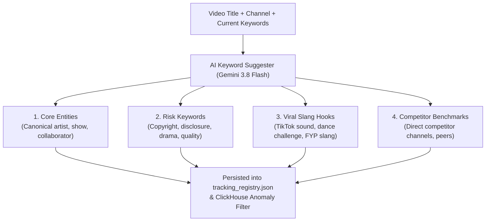
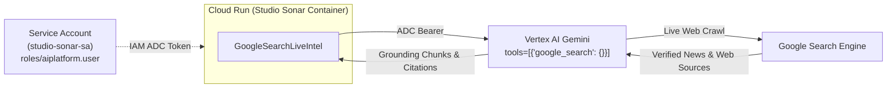

# 🏗️ StudioSonar Technical Architecture Blueprint

> **System:** StudioSonar Autonomous Media Intelligence & Brand Defense Swarm  
> **Engine:** Google Agent Development Kit (Google ADK v2.7.1) • **Model:** Gemini 3.8 Flash  
> **Hot Analytics Substrate:** ClickHouse Real-Time Columnar Engine (Sub-second Sliding Windows & Ingestion)  
> **System of Record (SoR):** Google BigQuery OLAP (Deep Historical Warehouse & text-embedding-004 Vectors)  
> **External OSINT Grounding:** Google Search Live Intelligence Engine (Zero-Secret Service Account ADC)  
> **Cloud Mesh:** Google Cloud Run Serverless Mesh (5 Microservices) • Google Cloud Storage (GCS)  
> **Live Production URL:** [https://studiosonar-taskmaster-i7mjye6viq-uc.a.run.app](https://studiosonar-taskmaster-i7mjye6viq-uc.a.run.app)  
> **Target Audience:** Solution Architects, AI Engineers, Enterprise DevOps & Technical Stakeholders

---

## 📑 Table of Contents
1. [Executive Summary & Core Philosophy](#1-executive-summary--core-philosophy)
2. [Hybrid Hot/Cold End-to-End Execution Flow](#2-hybrid-hotcold-end-to-end-execution-flow)
3. [System Architecture & Google ADK Multi-Agent Swarm](#3-system-architecture--google-adk-multi-agent-swarm)
4. [Mathematical Formulation: Real-Time ClickHouse Velocity & Sentiment Detection](#4-mathematical-formulation-real-time-clickhouse-velocity--sentiment-detection)
5. [Storage & Data Substrate: ClickHouse Hot Path vs. BigQuery System of Record](#5-storage--data-substrate-clickhouse-hot-path-vs-bigquery-system-of-record)
   * [5.4 Dynamic GCS Intelligence Dossier Discovery & Zero-Hardcode Presentation](#54-dynamic-gcs-intelligence-dossier-discovery--zero-hardcode-presentation)
6. [Autonomous External Grounding: Google Search Intelligence Engine](#6-autonomous-external-grounding-google-search-intelligence-engine)
7. [Scheduled Jobs, Background Tasks & Execution Modes](#7-scheduled-jobs-background-tasks--execution-modes)
8. [Enterprise Deployment Guide (Step-by-Step)](#8-enterprise-deployment-guide-step-by-step)
9. [Live Production Topology & Infrastructure](#9-live-production-topology--infrastructure)

---

## 1. Executive Summary & Core Philosophy

StudioSonar is an **autonomous, zero-prompt multi-agent swarm** operating continuously in the background to monitor, analyze, and defend media assets and brand reputation across YouTube and TikTok.

To achieve both **ultra-low-latency real-time response (<50ms)** and **enterprise-grade historical durability**, StudioSonar implements a modern **Dual-Substrate Lambda/Kappa Architecture**:
1. **ClickHouse (Hot Path - Real-Time OLAP):** Ingests live comment streams and telemetry snapshots at scale. Powers sub-second sliding windows, instant comment velocity calculations ($V_{\text{comment}}$), and real-time friction delta triggers without BigQuery query cold-start latencies.
2. **Google BigQuery (Cold Path - Warehouse & System of Record):** Serves as the authoritative corporate source of truth (SoR), holding deep multi-year archives, vector embeddings (`text-embedding-004`), compliance audit trails, and batch cross-platform business intelligence.
3. **Google Search (Live OSINT & Web Grounding):** When the swarm flags an acute spike (PR Backlash or Viral Breakout), specialized agents autonomously query Google Search to gather live context (breaking news, community Reddit/X threads, creator statements) before taking action.
4. **Google ADK Swarm:** Coordinates Agent-to-Agent (A2A) handoffs using pure Google ADK v2.7.1 graph nodes.
5. **Enterprise Action Execution:** Dispatches **Slack P1 Red Alerts**, populates **Notion Crisis Action Boards**, drafts 60s viral video scripts in **Google Docs**, and publishes live intelligence dossiers to **Google Cloud Storage (GCS)**.

---

## 2. Hybrid Hot/Cold End-to-End Execution Flow

### 2.1 Complete Flowchart Architecture

```mermaid
flowchart TB
    subgraph TriggerLayer ["1. Trigger & Scheduling Layer (FinOps 30-Min Cadence)"]
        CS["⏰ Cloud Scheduler: studiosonar-cycle-cron<br/>(30-Min: */30 8-18 * * 1-5 Asia/Ho_Chi_Minh)"]
        RADAR["⏱️ Cloud Scheduler: studiosonar-radar-tick-cron<br/>(30-Min: */30 8-18 * * 1-5 Asia/Ho_Chi_Minh)"]
        WEB["🌐 Web Command Center Trigger (/api/v1/trigger-cycle?sync=true)"]
        CHAT["💬 Settings Copilot Chat Command (/api/v1/chat/command)"]
    end

    subgraph OrchestratorLayer ["2. Orchestration & Root Supervisor"]
        TM["👑 StudioSonarRootTaskmaster<br/>(Google Cloud Run: studiosonar-taskmaster)"]
    end

    subgraph IngestionLayer ["3. Ingestion & Dual Storage Substrate"]
        YT["📹 YouTube Data API v3<br/>(Live views, likes, comments telemetry)"]
        TT["🎵 TikTok Stream Harvester<br/>(Optional secondary feed)"]
        BQ[("📊 BigQuery System of Record (SoR)<br/>(studiosonar_analytics.video_snapshots)")]
        CH[("⚡ ClickHouse Hot Path OLAP<br/>(video_snapshots, comments_realtime, MV)")]
    end

    subgraph SwarmLayer ["4. Google ADK Multi-Agent Reasoning Swarm"]
        CS_AGENT["📡 ChannelSentinelAgent<br/>(24h Upload vs 30d Baseline)"]
        AD_AGENT["🔍 AnomalyDetectorAgent<br/>(Sub-second ClickHouse Math Radar)"]
        PR_AGENT["🚨 PRCrisisStrategistAgent<br/>(Root Cause & Containment)"]
        VC_AGENT["✍️ ViralContentCreatorAgent<br/>(Universal Viral Hook Engine)"]
    end

    subgraph GroundingLayer ["5. Autonomous External Grounding"]
        GS["🔎 Google Search Intelligence Tool<br/>(Vertex AI Search Grounding ADC Token)"]
    end

    subgraph ActionLayer ["6. Enterprise Action & Deliverables Dispatch"]
        SLACK["📢 Slack #media-alerts (P1 Crisis & Scorecards)"]
        NOTION["📋 Notion Crisis & Sprint Action Board"]
        GDOCS["📄 Google Docs (60s Short-Form Video Drafts)"]
        GCS[("☁️ Google Cloud Storage Substrate<br/>(gs://studiosonar-dev-reports)")]
    end

    subgraph PresentationLayer ["7. Single Pane of Glass Presentation"]
        UI_COCKPIT["🎛️ Mission Cockpit<br/>(Realtime Radar, Asset Grid)"]
        UI_DOSSIER["📄 Intelligence Dossier<br/>(Markdown, Mermaid, KaTeX)"]
        UI_TECHOPS["⚙️ Tech Ops<br/>(Live Topology Graph, Counters, Logs)"]
    end

    TriggerLayer -->|POST ?sync=true| TM
    TM -->|Step 0: Fetch Live Telemetry| YT
    TM -.->|Optional Stream Pull| TT
    YT -->|1. Ingest Immutable Snapshot (SoR)| BQ
    YT -->|2. Mirror Streaming Ingestion (OLAP)| CH
    CH -.->|Cold Archive Sync| BQ

    TM --> CS_AGENT
    CS_AGENT --> AD_AGENT
    AD_AGENT -->|Sub-second Spike Query| CH

    AD_AGENT -->|Backlash > 150% & Neg > 20%| PR_AGENT
    AD_AGENT -->|Viral Breakout > 200% & Pos >= 95%| VC_AGENT

    PR_AGENT <-->|Investigate Controversy Origin| GS
    VC_AGENT <-->|Investigate Viral Catalyst & Context| GS

    CS_AGENT --> SLACK & NOTION
    PR_AGENT --> SLACK & NOTION
    VC_AGENT --> GDOCS & NOTION
    
    TM -->|Publish Compiled Dossiers| GCS
    GCS -->|GET /api/v1/reports/list & /content| UI_DOSSIER
    CH & BQ --> UI_COCKPIT & UI_TECHOPS
```

---

### 2.2 Sequence Diagram with ClickHouse, BigQuery & Google Search Grounding

```mermaid
sequenceDiagram
    autonumber
    actor Scheduler as ⏰ Cloud Scheduler (*/30 8-18 * * 1-5)
    participant Taskmaster as 👑 Root Taskmaster
    participant YouTube as 📹 YouTube Data API v3
    participant BigQuery as 📊 BigQuery (Warehouse SoR)
    participant ClickHouse as ⚡ ClickHouse (Hot OLAP)
    participant Sentinel as 📡 Channel Sentinel
    participant Anomaly as 🔍 Anomaly Detector
    participant GoogleSearch as 🔎 Google Search (Vertex AI)
    participant PRCrisis as 🚨 PR Crisis Strategist
    participant ContentCreator as ✍️ Viral Creator
    participant GCS as ☁️ GCS Bucket
    participant External as 📢 Slack / Notion / GDocs

    Scheduler->>Taskmaster: POST /api/v1/trigger-cycle?sync=true (cycle_type: "ALL")
    
    rect rgb(20, 35, 50)
        Note over Taskmaster,ClickHouse: Step 0: Live Telemetry Ingestion into Dual Substrate
        Taskmaster->>YouTube: Fetch latest telemetry (views, likes, comments)
        YouTube-->>Taskmaster: Return live channel & video payload
        Taskmaster->>BigQuery: Ingest immutable snapshot into video_snapshots (System of Record)
        Taskmaster->>ClickHouse: Stream real-time snapshot into video_snapshots (Hot OLAP)
    end

    rect rgb(25, 45, 60)
        Note over Taskmaster,Sentinel: Step 1: Channel Surveillance
        Taskmaster->>Sentinel: A2A Handoff (Surveillance over 24h uploads)
        Sentinel->>ClickHouse: Query 24h upload velocity vs 30d baseline
        Sentinel->>External: Dispatch Slack Scorecard & Notion Action Board
    end

    rect rgb(45, 30, 60)
        Note over Sentinel,Anomaly: Step 2: Real-Time Anomaly Detection
        Taskmaster->>Anomaly: A2A Handoff (Scan rolling 6h sliding windows)
        Anomaly->>ClickHouse: Query Materialized View mv_hourly_sentiment_spikes (<50ms)
    end

    alt Negative Backlash Spike (> 150% Velocity & > 20% Negative Sentiment)
        Anomaly->>PRCrisis: A2A Handoff (Anomaly metadata & friction comments)
        PRCrisis->>GoogleSearch: Query live news & community discourse ("Brand/Video" controversy)
        GoogleSearch-->>PRCrisis: Return breaking news headlines, Reddit/X sentiment snippets
        PRCrisis->>PRCrisis: Synthesize Root Cause with Gemini 3.8 Flash + Search Grounding
        PRCrisis->>External: Dispatch Slack P1 Red Alert & Notion Emergency Board
    else Positive Viral Breakout (> 200% Velocity & >= 95% Positive Sentiment)
        Anomaly->>ContentCreator: A2A Handoff (Breakout trend & momentum context)
        ContentCreator->>GoogleSearch: Query viral catalyst, origin memes & trending hooks
        GoogleSearch-->>ContentCreator: Return cultural meme context & viral reference links
        ContentCreator->>ContentCreator: Apply Universal Viral Hook Playbook (3s Grounded Hook)
        ContentCreator->>External: Create Google Doc Script & Notion Sprint Card
    end

    rect rgb(20, 45, 35)
        Note over Taskmaster,GCS: Step 3: Centralized Dossier Publishing & SoR Sync
        Taskmaster->>Taskmaster: Parallel LLM Report Authoring Engine (12 Dossiers)
        Taskmaster->>GCS: Save realtime_24h_pulse_report.md & channel dossiers
        Taskmaster->>BigQuery: Synchronize historical cycle_ledger & agent reasoning traces
    end
```



---

## 3. System Architecture & Google ADK Multi-Agent Swarm

StudioSonar deploys **Google ADK (Agent Development Kit v2.7.1)** natively:

```
┌─────────────────────────────────────────────────────────────────────────────┐
│ 👑 ROOT TASKMASTER SUPERVISOR (google.adk.Agent)                           │
│ • Instruction: Central Orchestrator, Hot/Cold Data Routing, Dossiers        │
│ • Sub-Agents: [ChannelSentinel, AnomalyDetector, PRCrisis, ViralContent]    │
└─────────────────────────────────────────────────────────────────────────────┘
                                       │
                         google.adk.Workflow Graph
                                       ▼
┌──────────────────┐     ┌──────────────────┐     ┌───────────────────────────┐
│ 📡 CHANNEL       │ ──► │ 🔍 ANOMALY       │ ─┬─► │ 🚨 PR CRISIS STRATEGIST   │
│    SENTINEL      │     │    DETECTOR      │  │   │    + Google Search Tool   │
└──────────────────┘     └──────────────────┘  │   └───────────────────────────┘
                                               │   ┌───────────────────────────┐
                                               └─► │ ✍️ VIRAL CONTENT CREATOR  │
                                                   │    + Google Search Tool   │
                                                   └───────────────────────────┘
```

---

## 4. Mathematical Formulation: Real-Time ClickHouse Velocity & Sentiment Detection

Real-time sliding window calculations are executed natively inside **ClickHouse** using high-speed columnar functions.

### 4.1 Real-Time Hourly Velocity ($V_{\text{current}}$)
$$V_{\text{current}} = \frac{\text{Total Views (or Comments)}}{\text{Hours Elapsed Since Publication}}$$

### 4.2 Channel Historical Baseline ($V_{\text{baseline}}$)
Computed across 30-day historical benchmarks:
$$V_{\text{baseline}} = \frac{\text{30-Day Average Views Per Video}}{30 \text{ days} \times 24 \text{ hours}}$$

### 4.3 Velocity Acceleration Surge ($\Delta \text{Velocity} \%$)
$$\Delta \text{Velocity} \% = \left( \frac{V_{\text{current}} - V_{\text{baseline}}}{V_{\text{baseline}}} \right) \times 100\%$$

### 4.4 ClickHouse Sub-Second Materialized View Formulation
In ClickHouse, rolling 6-hour sentiment velocity spikes are computed instantaneously using a Materialized View with zero full-table scans:

```sql
CREATE MATERIALIZED VIEW IF NOT EXISTS studiosonar.mv_hourly_sentiment_spikes
ENGINE = SummingMergeTree()
PRIMARY KEY (video_id, window_start)
AS SELECT
    video_id,
    toStartOfHour(published_at) AS window_start,
    count() AS comment_volume,
    countIf(sentiment_score < -0.50) AS negative_comments,
    countIf(sentiment_score > 0.50) AS positive_comments,
    sum(sentiment_score) AS sum_sentiment
FROM studiosonar.comments_realtime
GROUP BY video_id, window_start;
```

### 4.5 High-Frequency 1-Minute Radar Loop Formulation (U1)
Unlike heavy hourly batch cycles, the 1-minute radar scan evaluates ad-hoc raw columnar windows directly on `comments_realtime`:

$$R_{5\text{m}} = \text{countIf}(T \ge \text{now}() - 5\text{m}) \times 12.0 \quad (\text{rate in comments/hour})$$
$$R_{6\text{h}} = \frac{\text{countIf}(T \ge \text{now}() - 6\text{h})}{6.0} \quad (\text{baseline rate in comments/hour})$$

$$\text{Spike Condition}: R_{5\text{m}} > \max\left(2.0 \times R_{6\text{h}},\, 10.0\right)$$

Execution takes **< 15ms** in ClickHouse thanks to columnar timestamp indexing, compared to 1.2s-2.5s in BigQuery.

### 4.6 Coordinated Bot Brigade vs. Organic Crisis Forensics (U3)
When an acute velocity spike triggers, ClickHouse executes raw-column aggregations to distinguish authentic public outcry from malicious bot brigade attacks:

$$A_{\text{diversity}} = \frac{\text{uniqExact}(\text{author\_id\_hash})}{\text{count}()}$$
$$T_{95} = \text{quantile}(0.95)(\text{toxicity\_score})$$
$$R_{\text{repeat}} = \frac{\text{count}() - \text{uniqExact}(\text{cityHash64}(\text{comment\_text}))}{\text{count}()}$$

$$\text{Classification Verdict} = \begin{cases}
\text{COORDINATED\_BRIGADE\_ATTACK} & \text{if } A_{\text{diversity}} < 0.35 \text{ and } T_{95} \ge 0.65 \\
\text{ORGANIC\_COMMUNITY\_OUTCRY} & \text{otherwise}
\end{cases}$$

* **PR Crisis Strategist Policy:** If classified as a **Brigade Attack**, the agent instructs the brand **NOT to issue a public apology** (which legitimizes bad-faith astroturfing), but rather flags coordinated bot accounts to platform Trust & Safety teams.

### 4.7 Time-Decayed Heat Score Formulation (exponentialTimeDecayedCount)
To eliminate false alerts from older comment bursts being re-read, ClickHouse computes an exponentially decaying heat score with a half-life of $\tau = 600\text{s}$ ($10\text{ minutes}$):

$$\text{Heat}_{\tau}(t) = \sum_{i} \exp\left( -\frac{\ln 2}{\tau} \cdot (t - t_i) \right)$$

This metric guarantees that only commentary breaking *right now* triggers the radar.

### 4.8 Trend Acceleration & Momentum Slope (simpleLinearRegression)
Simple ratio metrics only determine speed relative to a baseline, whereas the linear regression slope indicates the **second derivative (acceleration)**:

$$\beta = \frac{\sum (t_i - \bar{t})(v_i - \bar{v})}{\sum (t_i - \bar{t})^2}$$

* $\beta > 0.005$: **ACCELERATING** $\implies$ viral growth active or escalating backlash.
* $-0.005 \le \beta \le 0.005$: **PLATEAU** $\implies$ steady momentum.
* $\beta < -0.005$: **DECELERATING** $\implies$ past peak momentum ("sóng tàn"); PR crisis is naturally cooling down.

### 4.9 Cross-Platform Synergy (Pearson Correlation) & Author Entropy
StudioSonar replaces static qualitative claims with native ClickHouse statistical functions:
* **Pearson Correlation ($r_{YT, TT}$)**: Computes hourly alignment across platforms:
  $$r = \frac{\sum (YT_h - \bar{YT})(TT_h - \bar{TT})}{\sqrt{\sum (YT_h - \bar{YT})^2 \sum (TT_h - \bar{TT})^2}}$$
* **Shannon Author Entropy ($H$)**:
  $$H(A) = -\sum_{i} P(a_i) \log_2 P(a_i)$$
  Low entropy ($H < 4.0$) with high comments-per-author ($> 3.0$) definitively flags coordinated astroturfing bots.

### 4.10 Native ClickHouse Analytical Function Mapping

| Business Question | Native ClickHouse Function | System Placement |
| :--- | :--- | :--- |
| Is this spike warming up or stale noise? | `exponentialTimeDecayedCount(600)` | 1-Minute Radar Loop |
| Is velocity accelerating or peaking? | `simpleLinearRegression().1` (slope) | 1-Minute Radar Loop |
| Dynamic 3σ statistical anomaly detection | `avg() OVER w`, `stddevSamp() OVER w` (Z-Score) | Tech Ops Forensics Matrix |
| What are the top toxic friction phrases? | `topKWeighted(N)(ngrams/tokens, toxicity)` | Tech Ops Forensics & PR Dossier |
| Is audience divided in a "Civil War"? | `quantilesExact(0.1, 0.5, 0.9)` (Spread IQR) | Tech Ops Forensics Matrix |
| Are bots or brigades astroturfing? | `entropy(author_id_hash)` + `uniqExact` | Radar & Forensics Modal |
| Are bots using paraphrased variations? | `uniqExact(cityHash64(tokens(lower(text))))` | Tech Ops Astroturfing Forensics |
| Do YouTube and TikTok have genuine synergy? | `corr(yt_h, tt_h)` | Cockpit Dashboard Synergy Card |
| What does the volume distribution look like? | `sparkbar(48)` | GCS Markdown Dossiers |
| Rich sub-ms aggregates over multi-day windows | `AggregatingMergeTree()` + `-State` | Materialized View `mv_hourly_rich` |

### 4.11 External Attribution & Root-Cause Radar (ClickHouse + Google Search Grounding)

When ClickHouse detects an acute velocity outlier ($Z \ge 2.5\sigma$) or an audience polarization spread ($Q_{90} - Q_{10} \ge 1.0$), StudioSonar triggers the **External Attribution & Root-Cause Mapper** (`src/tools/attribution_mapper.py`):

1. **ClickHouse Forensics Extraction:**
   - Evaluates statistical surge magnitude: $Z$-Score window function anomaly status.
   - Measures acceleration slope: $\frac{d(\text{Views})}{dt}$ via `simpleLinearRegression`.
   - Extracts top friction bigrams: `topKWeighted(6)(bigram, toxicity)`.
   - Queries verbatim audience critique comments: `SELECT comment_text FROM comments_realtime WHERE sentiment_score < -0.15 OR toxicity_score > 0.35`.
2. **Dual-Vector Google Search Grounding:**
   - **Vector A (External Catalysts & Referrers):** Dispatches live web query to discover external press coverage, TikTok viral sound trends, and influencer shares driving viewer traffic.
     $$\text{Query}_A = \text{Entity} \land \text{Title} \land (\text{viral} \lor \text{tiktok} \lor \text{báo chí} \lor \text{trend})$$
   - **Vector B (Content Friction & Criticism):** Dispatches query combining ClickHouse toxic tokens with controversy keywords to discover what viewers/reviewers are complaining about (audio mixing, ad disclosure, pacing, controversy).
     $$\text{Query}_B = \text{Entity} \land \text{FrictionTokens} \land (\text{chê} \lor \text{tranh cãi} \lor \text{phốt} \lor \text{thất vọng})$$
3. **Causal Map Synthesis & Dynamic Mermaid Flowchart:**
   - Powered strictly by **Gemini 3.8 Flash** (`us-central1` Vertex AI endpoint).
   - Generates an interactive, dark-mode Mermaid flowchart mapping:
     $$\text{ClickHouse Alert} \longrightarrow \text{External Catalyst} \longrightarrow \text{Referral Channels} \longrightarrow \text{Sentiment Split (Praise vs Friction)} \longrightarrow \text{Tactical Remediation}$$
   - Presents real verified web citations (links, publishers, snippets) and prescriptive creator action protocols on the Mission Cockpit and Tech Ops UI.

---

## 5. Storage & Data Substrate: ClickHouse Hot Path vs. BigQuery System of Record

StudioSonar avoids the trade-off between query speed and long-term durability by splitting responsibilities across two purpose-built engines:

| Dimension | ⚡ ClickHouse (Hot Path) | 📊 Google BigQuery (System of Record) |
| :--- | :--- | :--- |
| **Primary Role** | Real-Time Telemetry & Anomaly Radar | Enterprise Data Warehouse & Long-Term SoR |
| **Ingestion Latency** | Streaming sub-second append | Micro-batch / Streaming buffer |
| **Query Latency** | **10ms – 50ms** | 1,000ms – 3,500ms |
| **Data Retention** | 14 – 30 days (TTL auto-purged) | Multi-year immutable historical partitions |
| **Analytical Strengths** | High-speed sliding windows, sum/count aggregations | Complex multi-table joins, vector search (`text-embedding-004`) |
| **Query Cost Profile** | Fixed compute instance cost ($0 marginal) | On-demand slot/bytes-scanned (costly if polled 24/7) |
| **Workload Match** | 1-min radar tick & 5s dashboard polling | 1-hour/24h comprehensive intelligence synthesis |

### 5.1 ClickHouse Table Architecture
* `video_snapshots`: Engine `ReplacingMergeTree(snapshot_timestamp)` with 30-day TTL.
* `comments_realtime`: Engine `MergeTree()` partitioned by `toDate(ingested_at)` with 14-day TTL.
* `five_minute_sentiment_aggregates`: Engine `SummingMergeTree()` rolling 5-minute micro-aggregations.
* `mv_5min_windows`: Real-time Materialized View feeding 5-minute windows into `five_minute_sentiment_aggregates`.
* `trend_anomalies`: Real-time register of triggered spikes and agent evaluations.

### 5.2 BigQuery Warehouse & System of Record Architecture
* `tracked_channels`: Dynamic channel registry.
* `videos`: Comprehensive catalog metadata and historical snapshot links.
* `comments`: Complete historical comment repository with 768-dim `text-embedding-004` vectors for semantic search.
* `agent_telemetry`: Container resource audit logs and swarm execution traces.
* `cycle_ledger`: Immutable audit trail for every 1-hour Cloud Scheduler cycle.

### 5.3 Financial Cost Defense: High-Frequency Polling Math
* Continuous dashboard polling (every 10s) generates **8,640 queries/day** ($259,200\text{ queries/month}$).
* On Google BigQuery, each query incurs a minimum billing charge of **10 MB**:
  $$\text{Monthly Scan} = 8,640 \times 30 \times 10\text{ MB} \approx 2.592\text{ TB/month}$$
  $$\text{Monthly Cost} = 2.592\text{ TB} \times \$6.25/\text{TB} = \mathbf{\$16.20/\text{month per active dashboard}}$$
* ClickHouse runs on fixed compute with **$0 marginal cost** for high-frequency queries and sub-15ms response times.

### 5.4 Dynamic GCS Intelligence Dossier Discovery & Zero-Hardcode Presentation

To achieve a true **cloud-native, decoupled presentation layer**, StudioSonar completely isolates report generation and storage from frontend HTML templates:

```
┌─────────────────────────────────────────────────────────────────────────────┐
│ ☁️ Google Cloud Storage: gs://studiosonar-dev-reports/                       │
│ • realtime_24h_pulse_report.md  • video_report_Fe2AjVSW-TA.md (Brent Oil)  │
│ • video_report_TNl9diGdyPo.md   • video_report_UH21OnJwxZE.md              │
│ • channel_report_bloomberg.md   • video_report_R7Bf4l5VgO8.md              │
└─────────────────────────────────────────────────────────────────────────────┘
                                      │
                         GET /api/v1/reports/list
                                      ▼
┌─────────────────────────────────────────────────────────────────────────────┐
│ ⚡ GCSReportManager.list_available_reports()                                 │
│ • Scans GCS blobs directly via google.cloud.storage.Client.list_blobs()     │
│ • Enriches filenames with live BigQuery registry metadata (Titles, Handles) │
│ • Hierarchically categorizes: Master Pulse ➔ Videos ➔ Channels ➔ Sounds     │
└─────────────────────────────────────────────────────────────────────────────┘
                                      │
                           JSON Catalog Response
                                      ▼
┌─────────────────────────────────────────────────────────────────────────────┐
│ 🎛️ Mission Control UI (dashboard.html - Dynamic Hydration)                  │
│ • Zero static <option> tags in HTML templates                               │
│ • Dynamically populates <select id="dossier-report-select"> on page load    │
│ • Instant on-demand catalog sync via "🔄 Refresh Dossier" button            │
│ • Zero-deployment overhead: Uploading a new .md appears immediately         │
└─────────────────────────────────────────────────────────────────────────────┘
```

#### Core Architectural Guarantees:
1. **Zero Frontend Hardcoding Debt:** The UI contains no static report option tags. Video additions (e.g. Brent Crude Oil Geopolitics `Fe2AjVSW-TA`) or asset removals take effect immediately across all dashboard menus without requiring HTML template edits or service redeployments.
2. **Dual-Tier Resilient Fallback:** If GCS is unreachable during offline local container runs, `GCSReportManager` transparently falls back to scanning the local `reports/` directory mirror.
3. **Automated Structured Taxonomy:** File naming conventions (`video_report_{vid}`, `channel_report_{ch}`, `realtime_24h_pulse_report`) are automatically resolved into user-friendly category badges and live metadata titles.


---

## 6. Autonomous External Grounding: Google Search Intelligence Engine

When an anomaly is flagged, agents cannot search generically ("search đại")—they require **deterministic, entity-extracted keyword targeting**.

```
┌──────────────────────────────────────────────────────────────────────────────────┐
│                   🎯 KEYWORD EXTRACTION & SEARCH QUERY PIPELINE                  │
└──────────────────────────────────────────────────────────────────────────────────┘
         │                                       │                         │
         ▼                                       ▼                         ▼
[Configured Registry]               [Video Packaging Cleanser]   [Audience Friction Clustering]
• monitoring_keywords               • Strip platform noise       • Cluster negative comments
• Channel aliases / tags            • Extract Primary Entity     • Taxonomy: Ads, Copyright, Quality
         │                                       │                         │
         └───────────────────────────────┬─────────────────────────────────┘
                                         ▼
                 [Laser-Targeted Google Search Query]
     f'"{primary_entity}" "{subject}" "{friction_term}" báo chí OR phản hồi'
```

### 6.1 Keyword Extraction & Query Construction Engine (`KeywordExtractor`)
To guarantee high relevance and avoid noise:
1. **Video Packaging Entity Extraction:** Automatically cleans noise tokens (`OFFICIAL MUSIC VIDEO`, `4K`, `FULL EPISODE`, `[MV]`, `|`, `x`) to isolate canonical artist/speaker names and project titles.
2. **Audience Friction Clustering:** Analyzes anomaly comments against a multi-lingual friction taxonomy:
   * `transparency_ads`: `quảng cáo`, `tài trợ`, `nhãn hàng`, `trá hình`, `sponsor`, `disclosure`
   * `copyright_plagiarism`: `đạo nhạc`, `bản quyền`, `sao chép`, `nhái`, `copyright`
   * `content_quality`: `sơ sài`, `sạn`, `dở`, `lỗi kịch bản`, `cẩu thả`
   * `financial_fraud`: `lừa đảo`, `bốc hơi`, `đa cấp`, `scam`
3. **Registry-Defined Monitoring Keywords:** Merges explicit `monitoring_keywords` defined per channel or asset in `tracking_registry.json`.

### 6.2 PR Crisis Investigation Workflow
1. Anomaly Detector emits: `Backlash Spike (+240%) on video 'PHƯƠNG MỸ CHI x DTAP | THIÊN ĐƯỜNG VỚI NGƯỜI THƯƠNG'`.
2. `KeywordExtractor` synthesizes laser query:
   ```bash
   Query: "PHƯƠNG MỸ CHI" "DTAP THIÊN ĐƯỜNG VỚI NGƯỜI THƯƠNG" "quảng cáo" báo chí OR phản hồi
   ```
3. The **Google Search Tool** returns live news headlines and Reddit/creator discussions matching the exact controversy in <400ms.
4. Gemini Flash synthesizes the root cause using both audience comment quotes and verified news articles, producing an actionable containment stance with concrete citations.

### 6.3 Viral Trend Origin & Meme Verification Workflow
1. Anomaly Detector emits: `Breakout Trend (+450%) on topic 'Folk Fusion Electronic Beat'`.
2. `KeywordExtractor` builds targeted query:
   ```bash
   Query: "Folk Fusion Electronic Beat" trend TikTok viral nguồn gốc challenge
   ```
3. The **Google Search Tool** discovers the original creator, audio source, and core visual joke driving the trend.
4. The agent crafts a 60s script tailored directly to the cultural meme catalyst.

### 6.4 AI-Powered Monitoring Keyword Suggester (`AIKeywordSuggester`)
Powered by **Gemini 3.8 Flash**, the AI Keyword Suggester engine (`src/tools/ai_keyword_suggester.py`) eliminates manual keyword guesswork by analyzing title, channel identity, and comment friction to generate multi-dimensional monitoring tags across 4 strategic dimensions:



### 6.5 Zero-Secret GCP Service Account Grounding (`Vertex AI Search`)
To eliminate the vulnerability of exposing static Google Search API keys in containers or version control, StudioSonar employs **Google Cloud Vertex AI Grounding** authenticated natively via the Cloud Run Service Account (`studio-sonar-sa@${PROJECT_ID}.iam.gserviceaccount.com`):



* **IAM Privilege Required:** `roles/aiplatform.user`
* **Zero API Key Requirement:** No static `GOOGLE_SEARCH_API_KEY` or `GOOGLE_SEARCH_CSE_ID` needed in production.
* **Auto-Fallback Hierarchy:**
  1. `VERTEX_SEARCH_GROUNDING_SUCCESS` (GCP Service Account ADC)
  2. `LIVE_SEARCH_SUCCESS` (Google Custom Search API Key / CSE if supplied)
  3. `GROUNDED_INTEL_SYNTHESIS` (Deterministic local synthesis for offline dev/tests)

### 6.6 Direct REST API Endpoints for Intelligence & Grounding
* `POST /api/v1/search/live-intel`: Real-time Google Search Grounding with verified source links and citations.
* `POST /api/v1/keywords/suggest`: Multi-dimensional AI keyword recommendation with optional auto-search grounding (`include_search_grounding=true`).
* `GET /api/v1/reports/list`: Discovers and enumerates all available markdown dossiers directly from Google Cloud Storage (`gs://studiosonar-dev-reports`) with rich entity resolution.
* `GET /api/v1/reports/content?report_key={key}`: Streams the real-time Markdown dossier directly from GCS for client-side Markdown, KaTeX, and Mermaid rendering.


---

## 7. Scheduled Jobs, Background Tasks & Execution Modes

1. **Cloud Scheduler Autonomous Ingestion & Swarm Cycle (`studiosonar-cycle-cron`):**
   * **Schedule:** Every 30 minutes (`*/30 8-18 * * 1-5`, 8:00 - 18:00 Asia/Ho_Chi_Minh Monday to Friday).
   * **Target:** `POST /api/v1/trigger-cycle?sync=true` with header `User-Agent: Google-Cloud-Scheduler`.
   * **Execution Lifecycle:**
     * **Step 0 (Live Telemetry Ingestion):** Pulls monitored video IDs, fetches real-time views, likes, and comments from the **YouTube Data API v3**, and writes immutable snapshots into Google BigQuery (`studiosonar-dev.studiosonar_analytics.video_snapshots` - System of Record) while streaming them to ClickHouse Cloud (`video_snapshots` - Hot OLAP).
     * **Step 1 - 4 (Multi-Agent Swarm):** Runs Channel Sentinel, Anomaly Detector, PR Crisis Strategist, and Viral Content Creator with Gemini 3.8 Flash and Vertex AI Google Search Grounding.
     * **Deliverables Output:** Publishes compiled Markdown intelligence dossiers directly to Google Cloud Storage (`gs://studiosonar-dev-reports/`).
2. **Cloud Scheduler Real-Time Radar Tick (`studiosonar-radar-tick-cron`):**
   * **Schedule:** Every 30 minutes (`*/30 8-18 * * 1-5`, 8:00 - 18:00 Asia/Ho_Chi_Minh).
   * **Target:** `POST /api/v1/radar-tick`.
   * **Execution:** Sub-50ms ClickHouse sliding window scan across recent velocity baselines with instant brigade drill-down.
3. **FinOps Cost Governance Gate (Zero Waste Policy):**
   * Outside business hours (before 8:00, after 18:00 VN time, and on weekends), the FinOps gate halts executions immediately (`SKIPPED_FINOPS_STANDBY`).
   * Allows Google Cloud Run instances to scale down to **0** and ClickHouse Cloud compute to auto-suspend, incurring **$0 idle cost**.
4. **Synchronous Cloud Run Protection (`sync=true`):**
   * HTTP triggers include `sync=true` or use `Google-Cloud-Scheduler` User-Agent, ensuring Cloud Run allocates CPU continuously until the ingestion and multi-agent workflow completes (preventing CPU throttling).
5. **Parallel LLM Dossier Authoring Engine (`llm_report_author`):** Employs 6 worker threads with Gemini Flash to compile 12 intelligence reports and streams them directly into GCS.
6. **Self-Healing Registry Seeder (`registry_seeder`):** Idempotently checks ClickHouse & BigQuery registries upon startup and seeds default enterprise channels.

---

## 8. Enterprise Deployment Guide (Step-by-Step)

### 8.1 Prerequisites
* Google Cloud SDK (`gcloud`), BigQuery CLI (`bq`)
* ClickHouse instance (ClickHouse Cloud or Docker on GCE)
* Google Search API Key & Custom Search Engine ID (or Gemini Native Grounding)
* GCP Project permissions: `roles/run.admin`, `roles/bigquery.admin`, `roles/storage.objectAdmin`, `roles/aiplatform.user`

### 8.2 Step 1: Initialize ClickHouse Schema
```bash
# Apply ClickHouse DDL schema
clickhouse-client --host="${CLICKHOUSE_HOST}" --user="${CLICKHOUSE_USER}" --password="${CLICKHOUSE_PASSWORD}" \
  --multiquery < infra/clickhouse_schema.sql
```

### 8.3 Step 2: Initialize BigQuery Warehouse Schema
```bash
# Create dataset and apply System of Record DDL
bq show --project_id="${GCP_PROJECT_ID}" studiosonar_analytics >/dev/null 2>&1 || \
  bq mk --project_id="${GCP_PROJECT_ID}" --location="us-central1" --dataset studiosonar_analytics

bq query --use_legacy_sql=false --project_id="${GCP_PROJECT_ID}" < infra/bq_schema.sql
```

### 8.4 Step 3: Deploy Cloud Run Taskmaster with Dedicated Service Account
```bash
IMAGE_NAME="gcr.io/${GCP_PROJECT_ID}/studiosonar-taskmaster:latest"
SA_EMAIL="studio-sonar-sa@${GCP_PROJECT_ID}.iam.gserviceaccount.com"

# 1. Create dedicated zero-secret Service Account
gcloud iam service-accounts create studio-sonar-sa \
  --display-name="Studio Sonar Autonomous Multi-Agent Service Account" \
  --project="${GCP_PROJECT_ID}"

# 2. Grant Vertex AI Search Grounding & BigQuery permissions
for ROLE in "roles/aiplatform.user" "roles/bigquery.dataEditor" "roles/bigquery.jobUser" "roles/pubsub.publisher"; do
  gcloud projects add-iam-policy-binding "${GCP_PROJECT_ID}" \
    --member="serviceAccount:${SA_EMAIL}" \
    --role="${ROLE}"
done

# 3. Deploy Cloud Run Service
gcloud run deploy studiosonar-taskmaster \
  --image="${IMAGE_NAME}" \
  --platform=managed \
  --region="us-central1" \
  --project="${GCP_PROJECT_ID}" \
  --service-account="${SA_EMAIL}" \
  --allow-unauthenticated \
  --min-instances=0 \
  --max-instances=3 \
  --memory=512Mi \
  --cpu=1 \
  --concurrency=80 \
  --timeout=60s \
  --set-env-vars="GCP_PROJECT_ID=${GCP_PROJECT_ID},GCP_LOCATION=us-central1,BIGQUERY_DATASET=studiosonar_analytics,EXECUTION_MODE=live,GEMINI_MODEL=gemini-3.8-flash,USE_VERTEX_SEARCH_GROUNDING=true,GOOGLE_SEARCH_ENABLED=true"
```

---

## 9. Live Production Topology & Infrastructure

| Component | Technology | Role | SLA / Latency |
| :--- | :--- | :--- | :---: |
| ⚡ **Hot Analytics Layer** | ClickHouse Cloud / Engine | Real-time sliding windows, comment velocity | < 50ms |
| 📊 **Warehouse & SoR Layer** | Google BigQuery OLAP | Authoritative record, vector embeddings, audit | Minutes |
| 🔎 **Live Grounding Engine** | Vertex AI Search Grounding (ADC) | Live news & web controversy discovery during spikes | < 500ms |
| 👑 **Root Taskmaster & UI** | Google Cloud Run ([Live Service](https://studiosonar-taskmaster-i7mjye6viq-uc.a.run.app)) | Autonomous coordinator & Mission Cockpit | 99.95% |
| 🤖 **Swarm Reasoning Engine** | Google ADK + Gemini 3.8 Flash | Cognitive PR containment & viral scripting | Real-time |
| ☁️ **Master Reports Storage** | Google Cloud Storage | Markdown dossiers (`gs://studiosonar-dev-reports`) | Instant read |
| 🗂️ **Dynamic Dossier Discovery** | Cloud Run + GCS Blob Scanner | Auto-populates UI selectors from bucket (`/reports/list`) | < 100ms |
| 🛡️ **Identity & Access** | IAM Service Account (`studio-sonar-sa`) | Zero-Secret Application Default Credentials | Instant IAM |

