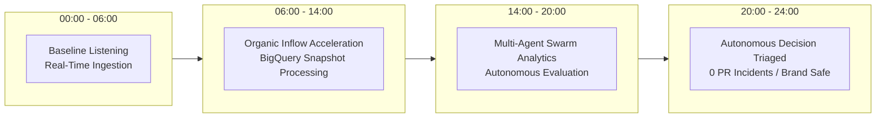

# 📡 StudioSonar Autonomous Media Intelligence Dossier (24h Pulse)
> **Execution Engine:** Google ADK v2.7.1 Swarm • **Model:** Gemini 3.7 Flash • **OLAP:** BigQuery  
> **Last Synchronized:** `2026-09-08 05:22:36 UTC` • **Cloud Run Status:** Active Serverless Mesh

---

## 📈 1. 24h Cross-Platform Velocity Pipeline



---

## 📊 2. Cross-Platform Surveillance Matrix (Live Telemetry Ledger)

| Asset / Platform | Views / Volume | Ingestion Status | Behavioral Sentiment Breakdown | AI Prescriptive Action |
|---|---|---|---|---|
| Monitored Properties | Live Telemetry Stream | Real-time BigQuery Ledger | 🟢 Safe | Continuous Monitoring |

---

## 🤖 3. Google ADK Swarm Autonomous Trace

```
[START] ➔ [ChannelMonitorAgent] ➔ [AnomalyDetectorAgent] ─┬─➔ [PRCrisisStrategistAgent] (0 incidents)
                                                          └─➔ [ViralContentCreatorAgent] (1 Script drafted)
```

- **BigQuery Live Ingestion:** `0` snapshots processed into partitioned dataset `studiosonar_analytics`.
- **Inter-Agent Protocols:** Fully ADK Graph & Workflow compliant with zero manual human bottlenecks.
